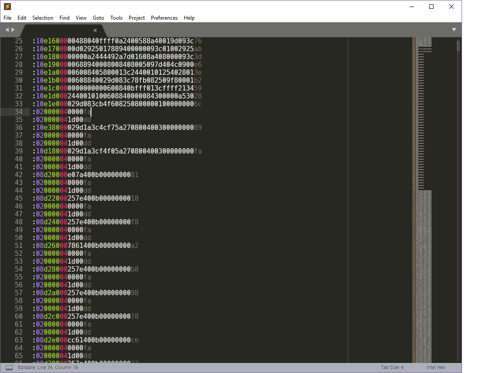

# Intel Hex Syntax Highlighting
This is syntax highlighting in for the Intel Hex record format in Sublime
Text 3.

Here is an image of what it looks like with some assembly code.

## Self Install
To install on your own, first download a copy of the whole package. Then in
Sublime Text, go to Preferences then Browse Packages. Copy the entier package
into the User directory.

## Contributing You will need

You will need [PackageDev](https://github.com/SublimeText/PackageDev) to convert
the YAML file to XML. You can send pull requests via GitHub. Do *not* edit the
`intel- hex.tmLanguage` file directly. Edit the `intel-hex.YAML-tmLanguage` file
and build the `.tmLanguage` file from it using the `Convert (JSON, YAML, PList)
to...` tool in PackageDev.
